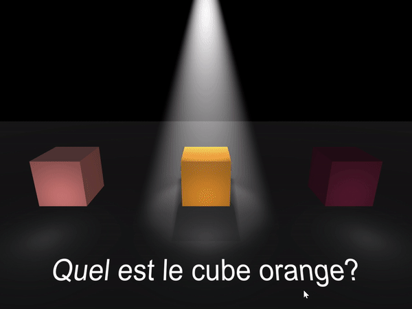

# UnityDemo_CubeColorQuiz

A small Unity demo made for [RealityZ](http://realityz.fr/)

Simple quiz: you have to choose a cube of a corrct color.

Project employs a data asset system with a list of colors along with their respective names (in french in this example).